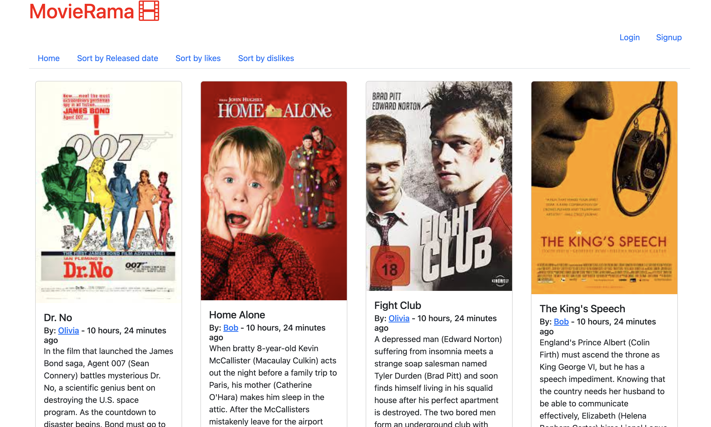

# Movierama 🍿📽️ 🎞️
Movies social sharing platform 



## Table of contents
1. [Local development](#local-development)
2. [Local docker development](#local-docker-development)
3. [Project folder structure](#project-folder-structure)
4. [Api docs](#api-docs)

### Local development 
**_NOTE:_**  for local development 💻 the used database is the `sqlite3`

#### Requirements
1. python version: `3.8.6`
2. poetry version: `1.3.1`

#### Setup your local env:
Run the following command:
```bash
make install-local
```
[](https://asciinema.org/a/ZdKV1pTjJUU6nd7O7KRrYgZeF)
for creating:
1. new `python venv`: `.env`
2. install the dependencies using `poetry`
3. install the `pre-commit` hooks 
4. Create and run the `migrations`
5. create sample fake `users/movies`

Start the webserver
```bash
source .env/bin/activate && ./manage.py runserver
```

#### To see all the available commands run.
```bash
make help 
```
#### Run test-cases
```bash
make test 
```

### Local docker development
For local docker 🐳  development use the following commands:

Install pre-commit hooks
```bash
make install-hooks
```
Start containers 
```bash
make dev-up
```
Stop containers
```bash
make dev-down
```

### Project folder structure 

```
movierama
    ├── movies         # Django models 
    └── accounts       # Custom User model, authenticattion 
    └── api            # Rest API
    └── config         # Django global settings
    └── web_app        # Web application
    └── templates      # HTML templates
    └── tests          # Pytest test cases
```

## Api docs 

### For interacting with the `API` you can see all the available endpoints either from:

  * swagger-docs : `/swagger`
  * redoc: `/redoc`
  * django-rest-framework :`api/movies/v1/`


### For examples check: [api-docs-examples](api/api-docs.md)

**_NOTE:_** 
1. Due to an open-bug to swagger-docs for the `api` it's 
not possible to `upload` a movie cover. If you want to create a `movie`
with a movie-cover create a new one from the `homepage`
2. the `API` endpoints aren't **used** from the templates, instead the
[web-app-endpoints](https://github.com/iplitharas/movierama/blob/main/web_app/urls.py#L13) are
used